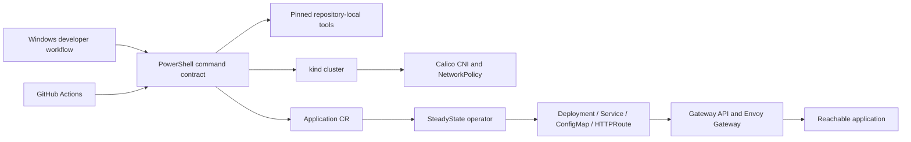

# SteadyState

SteadyState is a laptop-scale internal developer platform built around a Kubernetes operator. It demonstrates control-plane engineering, GitOps, progressive delivery, policy enforcement, observability, and tested recovery without requiring a cloud account.

Phase 0 establishes a reproducible Windows-first environment: pinned local tooling, kind clusters with Calico networking, Envoy Gateway using the Kubernetes Gateway API, automated smoke tests, and proof that NetworkPolicy is enforced. Phase 1 adds the `Application` API and a Kubernetes operator that owns, reconciles, observes, and self-heals each application's Deployment, Service, ConfigMap, and HTTPRoute. Phase 2 adds managed Team namespaces with quota, RBAC, NetworkPolicy isolation, and repository authorization.

> Status: Phase 0 and Phase 1 are complete. PR #10 was merged at `8229c7b`, post-merge Nightly Integration and CodeQL passed, and the annotated `v0.1.0` release is published. Phase 2 tenancy implementation is now beginning from that immutable baseline.

## Architecture



The repository is a monorepo. Operator APIs and controllers live alongside the CLI, local platform configuration, GitOps state, demo application, tests, and documentation so an end-to-end change can be reviewed in one pull request.

## Requirements

- Windows 10/11 with PowerShell 5.1 or newer.
- Git for Windows.
- Docker Desktop using Linux containers and its WSL2 backend.
- Docker Engine 24 or newer with cgroup v2 enabled.
- At least 6 GB allocated to Docker Desktop; 8 GB or more is recommended.
- Ports `8080` and `8443` available, or explicit alternatives.

Go, kind, kubectl, and Helm do not need global installation. SteadyState downloads verified, pinned versions into the ignored `.tools/` directory.

## Windows quickstart

```powershell
git clone https://github.com/saadabdullaah/steadystate.git
cd steadystate
.\scripts\dev.ps1 doctor
.\scripts\dev.ps1 tools
.\scripts\dev.ps1 check-versions
.\scripts\dev.ps1 test
.\scripts\dev.ps1 bootstrap -Profile minimal
```

After bootstrap:

```powershell
Invoke-WebRequest http://127.0.0.1:8080/healthz
.\scripts\dev.ps1 smoke
.\scripts\dev.ps1 test-network-policy
.\scripts\dev.ps1 destroy
```

To run the Phase 1 operator path on an existing standard-profile cluster:

```powershell
.\scripts\dev.ps1 build-images
.\scripts\dev.ps1 load-images
.\scripts\dev.ps1 deploy-operator
.\scripts\dev.ps1 test-operator
.\scripts\dev.ps1 demo-self-heal
```

The hosted integration workflow records the same destructive self-heal test against a disposable cluster:


[Hosted acceptance run 29260395935](https://github.com/saadabdullaah/steadystate/actions/runs/29260395935) recreated the Deployment in 0.300 seconds, repaired replica drift in 0.435 seconds, preserved Gateway reachability, and garbage-collected every owned child after releasing the finalizer.

Use `-Profile standard` for one worker or `-Profile full` for two workers. Override ports consistently when the defaults are occupied:

```powershell
.\scripts\dev.ps1 bootstrap -Profile minimal -ClusterName demo -HttpPort 9080 -HttpsPort 9443
```

## Linux and CI

Linux and GitHub Actions use the same PowerShell implementation through Make:

```bash
make tools
make test
make bootstrap PROFILE=minimal
make destroy
```

## Commands

| Command | Purpose |
|---|---|
| `doctor` | Report missing tools, Docker status, and port conflicts |
| `tools` | Download and verify the pinned local toolchain |
| `check-versions` | Assert installed versions match `scripts/versions.env` |
| `lint` | Run privacy, encoding, formatting, and Go static checks |
| `test` | Run Go tests |
| `bootstrap` | Reconcile a cluster and validate networking and routing |
| `smoke` | Verify the Gateway API route through the host port |
| `test-network-policy` | Prove traffic succeeds before and fails after deny policy |
| `build-images` / `load-images` | Build the operator and demo app, then load them into kind |
| `deploy-operator` / `undeploy-operator` | Reconcile or remove the in-cluster operator runtime |
| `test-operator` | Create the sample Application and verify it through Envoy Gateway |
| `demo-self-heal` | Delete and drift owned resources, then prove repair and garbage collection |
| `diagnostics` | Capture nodes, pods, events, gateway state, and kind logs |
| `destroy` | Idempotently delete the named kind cluster |

## Documentation

- [Architecture](docs/architecture.md)
- [Troubleshooting](docs/troubleshooting.md)
- [Contributing](CONTRIBUTING.md)
- [Security policy](SECURITY.md)
- [Architecture decision records](docs/adr/README.md)

## License

Licensed under the [Apache License 2.0](LICENSE).
