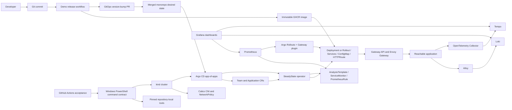
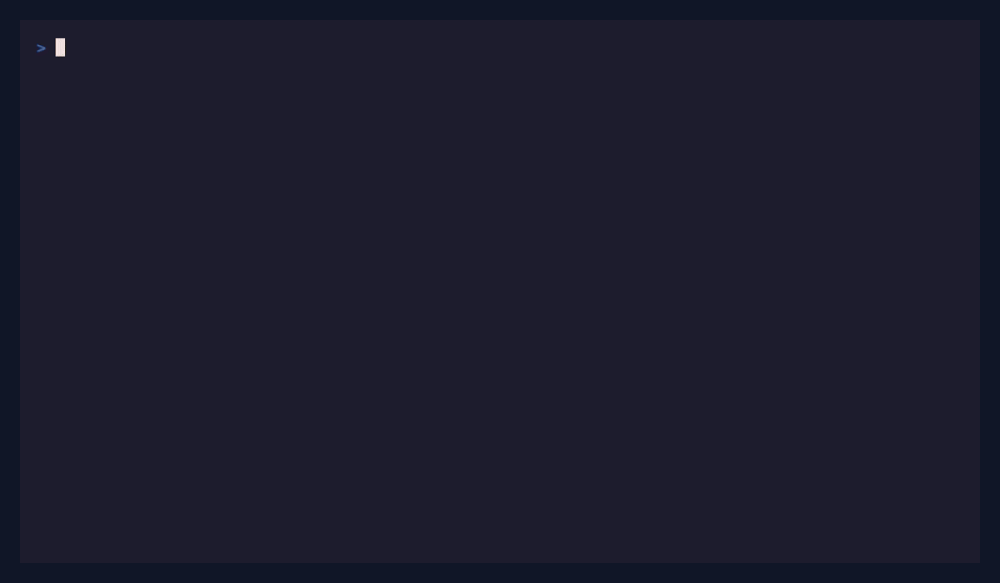
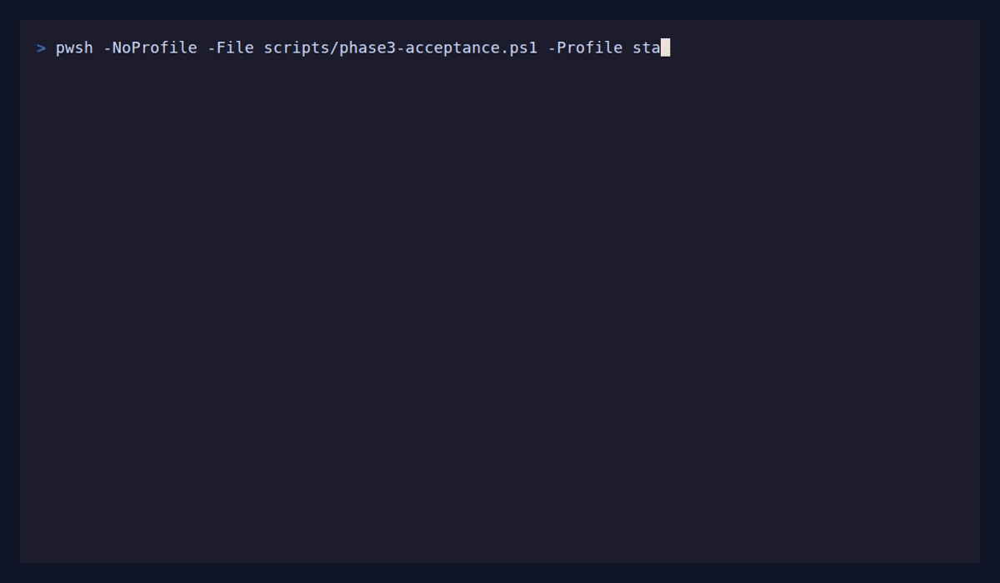
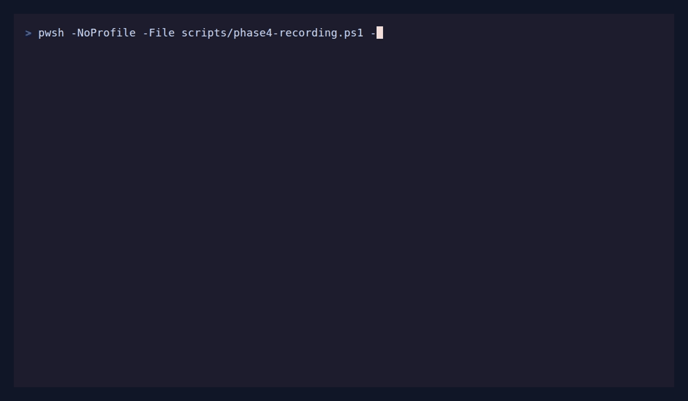
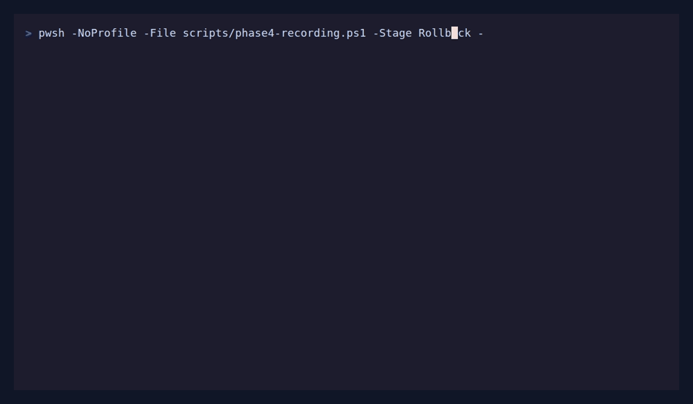

# SteadyState

SteadyState is a laptop-scale internal developer platform built around a Kubernetes operator. It demonstrates control-plane engineering, GitOps, progressive delivery, policy enforcement, observability, and tested recovery without requiring a cloud account.

Phase 0 establishes a reproducible Windows-first environment: pinned local tooling, kind clusters with Calico networking, Envoy Gateway using the Kubernetes Gateway API, automated smoke tests, and proof that NetworkPolicy is enforced. Phase 1 adds the `Application` API and a Kubernetes operator that owns, reconciles, observes, and self-heals each application's Deployment, Service, ConfigMap, and HTTPRoute. Phase 2 adds managed Team namespaces with quota, RBAC, NetworkPolicy isolation, and repository authorization. Phase 3 adds Argo CD app-of-apps delivery, immutable GHCR demo releases, automated GitOps pull requests, runtime image-digest and Git-revision provenance, and truthful Argo health. Phase 4 adds metric-gated Argo Rollouts canaries, Prometheus analysis, Envoy Gateway traffic weights, automatic rollback, and reversible strategy migration. Phase 5 adds structured request logs, W3C/OTLP traces, SLO recording and burn-rate alerts, correlated Grafana dashboards, and readiness-derived `ServiceHealth`.

> Status: Phases 0 through 4 are released through `v0.4.0`. Phase 5 is implemented as a `v0.5.0` release candidate, and its branch acceptance evidence is verified. Merge, demo-image delivery, exact-`main` regression workflows, tag, and release remain required.

## Architecture



The repository is a monorepo. Operator APIs and controllers live alongside the CLI, local platform configuration, GitOps state, demo application, tests, and documentation so an end-to-end change can be reviewed in one pull request.

## Requirements

- Windows 10/11 with PowerShell 5.1 or newer.
- Git for Windows.
- Docker Desktop using Linux containers and its WSL2 backend.
- Docker Engine 24 or newer with cgroup v2 enabled.
- At least 6 GB allocated to Docker Desktop; 8 GB or more is recommended.
- Ports `8080` and `8443` available, or explicit alternatives.

Go, kind, kubectl, and Helm do not need global installation. SteadyState downloads verified, pinned versions into the ignored `.tools/` directory.

## Windows quickstart

```powershell
git clone https://github.com/saadabdullaah/steadystate.git
cd steadystate
.\scripts\dev.ps1 doctor
.\scripts\dev.ps1 tools
.\scripts\dev.ps1 check-versions
.\scripts\dev.ps1 test
.\scripts\dev.ps1 bootstrap -Profile minimal
```

After bootstrap:

```powershell
Invoke-WebRequest http://127.0.0.1:8080/healthz
.\scripts\dev.ps1 smoke
.\scripts\dev.ps1 test-network-policy
.\scripts\dev.ps1 destroy
```

To run the Phase 1 operator path on an existing standard-profile cluster:

```powershell
.\scripts\dev.ps1 build-images
.\scripts\dev.ps1 load-images
.\scripts\dev.ps1 deploy-operator
.\scripts\dev.ps1 test-operator
.\scripts\dev.ps1 demo-self-heal
```

To run the Phase 2 tenancy acceptance suite after the operator test:

```powershell
.\scripts\dev.ps1 test-isolation -Profile standard -EvidencePath .artifacts/phase2/acceptance.json
```

The suite creates payments and orders tenants, proves direct cross-team traffic and RBAC are denied, proves Gateway traffic is allowed, rejects forbidden repositories and unmanaged namespaces, exercises quota admission, and deletes one Team without disturbing the other. It leaves the successful state available for `diagnostics`; `undeploy-operator` removes the acceptance resources.

[Hosted Phase 2 acceptance run 29337904627](https://github.com/saadabdullaah/steadystate/actions/runs/29337904627) passed all ten revision-bound checks on `b3b56a9`: Calico enforcement, concurrent tenant applications, cross-team Service and RBAC denial, sanctioned Gateway access, repository and unmanaged-namespace rejection, quota admission, and isolated Team deletion. The retained `phase2-acceptance-b3b56a9...` artifact contains the verified JSON evidence, rendered fixtures, and diagnostics.

The hosted integration workflow records the same destructive self-heal test against a disposable cluster:



[Hosted acceptance run 29260395935](https://github.com/saadabdullaah/steadystate/actions/runs/29260395935) recreated the Deployment in 0.300 seconds, repaired replica drift in 0.435 seconds, preserved Gateway reachability, and garbage-collected every owned child after releasing the finalizer.

To deploy and verify the Phase 3 GitOps path on a standard-profile cluster:

```powershell
.\scripts\dev.ps1 build-images
.\scripts\dev.ps1 load-images
.\scripts\dev.ps1 deploy-gitops -Profile standard
.\scripts\dev.ps1 test-gitops -Profile standard
Invoke-WebRequest http://argocd.localtest.me:8080
.\scripts\dev.ps1 undeploy-gitops
```

Argo CD manages its configuration, the operator, the payments Team, and the demo `Application`. The operator remains the sole owner of generated workload children. The `Application` status exposes the active `resolvedImageDigest` and `resolvedGitRevision`, while Argo health customizations translate current Team and Application conditions into Healthy, Progressing, or Degraded.



[Hosted Phase 3 acceptance run 29570255069](https://github.com/saadabdullaah/steadystate/actions/runs/29570255069) passed all 14 checks on `7f29303`. Artifact `8403532367` contains the 3,320,344-byte GIF, schema-versioned JSON, rendered GitOps state, registry metadata, Argo snapshots, controller logs, and cluster diagnostics; its SHA-256 is `0918fbb1c25b393291a6bd248d549f56027463d8befe3c495b7074b96b06f094`.

To verify Phase 4 progressive delivery after deploying the standard GitOps profile:

```powershell
.\scripts\dev.ps1 verify-progressive-delivery
.\scripts\dev.ps1 test-progressive-delivery -Profile standard -EvidencePath .artifacts/phase4/foundation.json
```

The `phase4-acceptance` command is the staged Prepare/Promote/Rollback runner composed by the repository's Phase 4 workflow; it requires the workflow's ephemeral branch and repository-scoped token context. The normal demo Application declares canary weights `10`, `25`, `50`, and `100`, each gated by Prometheus success-rate, P95-latency, and restart analysis. A good image promotes automatically. A failed analysis restores stable traffic, preserves the last healthy version/digest/revision tuple, and leaves desired state Degraded until a Git recovery commit. Strategy changes in either direction keep a verified data plane serving before obsolete resources are removed.





[Hosted Phase 4 acceptance run 29681093123](https://github.com/saadabdullaah/steadystate/actions/runs/29681093123) passed all 12 release-candidate checks: zero-downtime rolling-to-canary migration, measured `10/25/50/100` traffic, automatic good promotion, alert-backed bad-candidate abort at 10%, three stable-only recovery windows, truthful status/provenance, and zero-downtime canary-to-rolling migration. Artifact `8440858967` contains both GIFs, schema-versioned evidence, k6 results, AnalysisRuns, alert and registry metadata, rendered resources, controller logs, and 158 diagnostic files; GitHub records SHA-256 `8ebecbfb3517f850e88eaac375fad2fe09efb5ab357a2564f7f54e1590337b95`.

To verify the Phase 5 observability contracts and run the hosted-compatible test on an already deployed standard GitOps profile:

```powershell
.\scripts\dev.ps1 verify-observability
.\scripts\dev.ps1 test-observability -Profile standard
```

The platform extends the existing Prometheus/Grafana installation with single-binary Loki and Tempo, a read-only Alloy log collector, and one OpenTelemetry Collector. Applications opt into metrics, logs, and traces independently. `logs=false` excludes Pods from Alloy discovery, `traces=false` removes the OTLP environment and trace egress policy, and `metrics=false` deletes the Application-owned ServiceMonitor and PrometheusRule. `ServiceHealth=True` is derived only from the active workload and accepted HTTPRoute, so it adds no controller polling or dependency on Prometheus.

Grafana is available through `http://grafana.localtest.me:8080`; Prometheus, Loki, Tempo, and Alertmanager remain cluster-internal. The Phase 5 workflow records one request correlated by request ID and trace ID across all three data sources, proves telemetry opt-outs, fires the multi-window fast-burn alert with deterministic ten-percent failures, and enforces memory budgets before producing its GIF and schema-versioned evidence.


[Hosted Phase 5 acceptance run 29843478650](https://github.com/saadabdullaah/steadystate/actions/runs/29843478650) passed all eight checks against PR merge revision `1ba5bfa`: healthy pinned backends and Grafana datasources, one request correlated across Prometheus/Loki/Tempo, log/trace and metrics opt-outs, fast-burn alert propagation through Prometheus/Alertmanager/Grafana, resource budgets, and the progressive-delivery regression. [Artifact 8500873862](https://github.com/saadabdullaah/steadystate/actions/runs/29843478650/artifacts/8500873862) contains the 197,514-byte GIF, schema-versioned JSON, queries, alert and dashboard snapshots, rendered state, component logs, and success diagnostics. GitHub records artifact SHA-256 `f67b3e7090ee00ed60853dcfdbdffdc209a55c4bd7d56a4b7f56119852827cd9`; the GIF SHA-256 is `3791b01210e9842a0a32ae6ce6170a78a31fa8c8134fc61919a1c0398d0665d7`.

Use `-Profile standard` for one worker or `-Profile full` for two workers. Override ports consistently when the defaults are occupied:

```powershell
.\scripts\dev.ps1 bootstrap -Profile minimal -ClusterName demo -HttpPort 9080 -HttpsPort 9443
```

## Linux and CI

Linux and GitHub Actions use the same PowerShell implementation through Make:

```bash
make tools
make test
make bootstrap PROFILE=minimal
make test-isolation PROFILE=standard
make deploy-gitops PROFILE=standard
make test-gitops PROFILE=standard
make verify-progressive-delivery
make test-progressive-delivery PROFILE=standard
make phase4-acceptance PROFILE=standard
make verify-observability
make test-observability PROFILE=standard
make phase5-acceptance PROFILE=standard
make undeploy-gitops
make destroy
```

## Automated demo delivery

`apps/demo-app/VERSION` is the authoritative strict semver. A runtime-affecting demo change merged to `main` must bump it. The serialized Demo release workflow tests and publishes `linux/amd64` images to the public [SteadyState demo-app package](https://github.com/saadabdullaah/steadystate/pkgs/container/steadystate-demo-app) under immutable semver and full-source-SHA tags, verifies tag reuse by digest, and uses the repository-scoped delivery GitHub App only to open or update the GitOps manifest PR. Good and deterministic ten-percent-error variants remain immutable inputs for progressive-delivery and SLO acceptance. The `v0.5.0` binary adds JSON access logs and OTLP tracing without logging bodies, query strings, credentials, or request values. No mutable `latest` tag is published, and normal application delivery begins only after the generated good-image PR is reviewed and merged.

## Commands

| Command | Purpose |
|---|---|
| `doctor` | Report missing tools, Docker status, and port conflicts |
| `tools` | Download and verify the pinned local toolchain |
| `check-versions` | Assert installed versions match `scripts/versions.env` |
| `lint` | Run privacy, encoding, formatting, and Go static checks |
| `test` | Run Go tests |
| `bootstrap` | Reconcile a cluster and validate networking and routing |
| `smoke` | Verify the Gateway API route through the host port |
| `test-network-policy` | Prove traffic succeeds before and fails after deny policy |
| `build-images` / `load-images` | Build the operator and demo app, then load them into kind |
| `deploy-operator` / `undeploy-operator` | Reconcile or remove the in-cluster operator runtime |
| `test-operator` | Create the sample Team and authorized Application, then verify it through Envoy Gateway |
| `demo-self-heal` | Delete and drift owned resources, then prove repair and garbage collection |
| `test-isolation` | Prove Phase 2 network, Gateway, RBAC, repository, namespace, quota, and Team-deletion boundaries |
| `deploy-gitops` / `undeploy-gitops` | Reconcile or remove pinned Argo CD, its route, app-of-apps root, operator, Team, and demo Application |
| `test-gitops` | Verify pinned Argo installation, Dex removal, UI routing, exact revision inheritance, health, and demo reachability |
| `verify-gitops` | Render and structurally validate the Helm root, every Kustomize leaf, projects, sync policies, and ownership boundaries |
| `verify-progressive-delivery` | Verify pinned Rollouts, Gateway plugin, monitoring, CRDs, GitOps values, and generated progressive-delivery contracts |
| `test-progressive-delivery` | Prove the hosted-compatible Rollouts/Envoy weighted-routing and monitoring foundation on a standard cluster |
| `phase4-acceptance` | Run one workflow-controlled Prepare, Promote, or Rollback stage of the Git-only hosted acceptance flow |
| `verify-observability` | Verify chart checksums, deterministic GitOps renders, telemetry builders, SLO rules, datasources, and dashboards |
| `test-observability` | Run the Phase 5 correlated telemetry, opt-out, SLO alert, regression, and memory-budget proof on a prepared cluster |
| `phase5-acceptance` | Run one workflow-controlled Prepare, Test, Finalize, or failure-capture stage of Phase 5 acceptance |
| `diagnostics` | Capture nodes, pods, events, gateway state, and kind logs |
| `destroy` | Idempotently delete the named kind cluster |

## Documentation

- [Architecture](docs/architecture.md)
- [Troubleshooting](docs/troubleshooting.md)
- [Contributing](CONTRIBUTING.md)
- [Security policy](SECURITY.md)
- [Architecture decision records](docs/adr/README.md)
- [Resource budgets and benchmarks](docs/benchmarks.md)
- [Hosted evidence contracts](docs/evidence.md)

## License

Licensed under the [Apache License 2.0](LICENSE).
