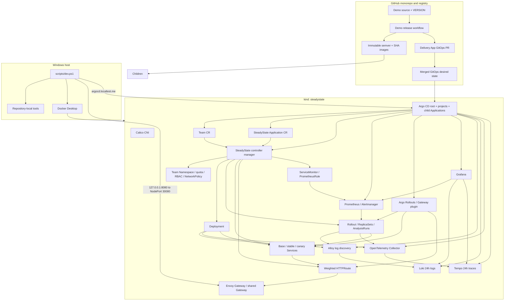

# Architecture Through Phase 5 Observability

## Profiles

| Profile | Nodes | Intended use |
|---|---:|---|
| `minimal` | 1 control plane | Pull-request smoke tests and constrained machines |
| `standard` | 1 control plane + 1 worker | Default development profile |
| `full` | 1 control plane + 2 workers | Later end-to-end demonstrations |

Every profile disables kindnet and installs Calico, making NetworkPolicy behavior observable. Envoy Gateway provides the maintained Gateway API implementation for north-south traffic.

Phase 0 owns cluster creation, networking, Gateway API installation, smoke resources, and diagnostics. Phase 1 adds a namespaced `Application` API and a watch-driven controller. Phase 2 adds a cluster-scoped `Team` API and one deterministic `team-<name>` boundary per Team. Phase 3 adds pinned Argo CD, immutable demo publication, repository-scoped delivery automation, runtime provenance, and hosted commit-to-cluster acceptance. Phase 4 adds pinned Argo Rollouts, the Gateway API traffic-router plugin, a trimmed Prometheus stack, operator-generated analysis/monitoring resources, reversible strategy migration, and automatic metric-gated promotion or rollback. Phase 5 extends that monitoring plane with logs, traces, SLO rules, dashboards, and truthful service health. Admission policy and stateful recovery remain later phases.

## Observability ownership and data flow

Argo CD owns the pinned Loki, Tempo, OpenTelemetry Collector, Alloy, and monitoring chart releases. The operator owns only each Application's telemetry intent: Pod labels, OTLP environment, an egress NetworkPolicy, ServiceMonitor, PrometheusRule, and status conditions. It does not query Prometheus, Loki, Tempo, Grafana, or Alertmanager while reconciling.

Alloy runs as a DaemonSet with read-only Pod discovery and `/var/log` access. It retains only Pods in `team-*` Namespaces labeled `steadystate.dev/logs=true`, parses the demo's JSON envelope, and forwards to single-binary Loki. Traced workloads export OTLP gRPC through an Application-owned policy to the single OpenTelemetry Collector, which adds Kubernetes resource attributes, rejects spans without service identity, batches, and forwards to Tempo. Loki and Tempo retain 24 hours in capped emptyDir storage; they are development evidence systems, not durable production stores.

Grafana is the only new externally routed component. Its explicit Prometheus, Loki, and Tempo datasources use stable UIDs, enabling deterministic logs-to-traces and traces-to-logs links. Dashboard ConfigMaps are GitOps-owned and sidecar-provisioned. The per-Application dashboard covers RED metrics, active/candidate versions, rollout state, availability burn, structured logs, and traces; the platform dashboard covers custom-resource health, rollout/SLO alerts, and memory footprint.

The generated PrometheusRule contains request-rate, error-rate, availability, P95 latency, and error-budget-burn recordings. Availability alerts follow multi-window burn policy: both five-minute and one-hour windows must exceed `14.4` for fast burn, and both 30-minute and six-hour windows must exceed `6` for slow burn. Empty request vectors evaluate as unavailable and empty latency vectors evaluate to a failing sentinel, avoiding false healthy results.

`ServiceHealth` is independent of telemetry backends. It is `True` only when the current active Deployment or Rollout is available and the HTTPRoute is accepted with resolved references. This watch-derived contract stays useful during a Prometheus/Loki/Tempo outage and preserves the controller's zero-polling design.

## Team tenancy contract

The Team controller owns the desired state of its Namespace, aggregate ResourceQuota, LimitRange defaults, owner RoleBinding, non-automounting ServiceAccount, and default-deny, DNS, and Envoy Gateway NetworkPolicies. A fixed Team owner ClusterRole is installed with the operator and bound only inside each managed Namespace. Because a cluster-scoped Team cannot control namespaced objects through owner references, every generated object carries a Team label and exact Team UID annotation. A reserved object without the matching UID is never adopted. Team deletion verifies both identifiers, deletes the Namespace, waits for namespace cascading, and only then releases the Team finalizer.

Applications are authorized from the Namespace boundary, never from the descriptive `spec.owner` field. The Application controller requires the deterministic namespace name, Team label, exact current Team UID, a non-terminating valid Team, and a repository matching one of the Team's anchored, case-sensitive Go path globs. Team and Namespace watches immediately reevaluate dependent Applications when authorization changes.

## Tenancy acceptance contract

`test-isolation` treats Calico readiness as a prerequisite rather than assuming a timeout proves NetworkPolicy enforcement. On a standard-profile cluster it creates payments and orders Teams and runs both Applications concurrently within their independent quotas. An orders Pod must time out against the payments Service ClusterIP, while both applications must remain reachable through their distinct shared-Gateway hostnames. The orders ServiceAccount is authorized for own-namespace Secrets and denied in payments. Forbidden repositories and Applications outside verified Team namespaces must report their exact rejection conditions without creating children, and ResourceQuota admission must reject a Pod above the Team ceiling. Finally, deleting orders must remove its Namespace while payments retains the same Namespace UID and remains Ready and reachable.

The command writes evidence only after every assertion passes. Hosted Nightly validation checks the evidence revision, profile, unique named checks, and result before uploading the JSON, rendered fixtures, and cluster diagnostics.

## GitOps revision and sync contract

The root Argo Application renders the small `gitops/clusters/local` Helm chart. Its resolved `$ARGOCD_APP_REVISION` becomes the `gitRevision` value for every child, preventing a root, platform, and tenant graph from mixing commits. Platform configuration and the operator use automated prune and self-heal. The tenant Application uses automated self-heal without prune; safe Git-driven Team deletion remains a later lifecycle design. `CreateNamespace` is intentionally absent because the Team controller must establish and own `team-payments` before the namespaced Application is admitted.

Sync waves establish AppProjects at `-30`, Argo configuration at `-20`, monitoring at `-18`, Rollouts at `-17`, the operator at `-10`, the tenant child at `0`, the Team CR at `-1`, and the SteadyState Application CR at `0`. Kustomize substitutes the exact Argo source revision into `steadystate.dev/source-revision` on the Team and Application leaves. Argo ignores controller-owned status and finalizers with `RespectIgnoreDifferences=true`. The root ignores the monitoring child as a repeated sync-wave health gate so a transient Prometheus chart health refresh cannot block an otherwise unrelated tenant commit; deployment and acceptance still explicitly require every platform child, including monitoring, to be Healthy before delivery begins.

The root project can create only AppProjects and Argo Applications in `argocd`. The platform project permits the exact cluster- and namespace-scoped kinds needed by Argo configuration and `config/default`. The tenant project permits only cluster-scoped Teams and namespaced SteadyState Applications from this repository into `team-*`; orphan warnings are disabled because generated application children belong to the operator.

## Argo health and ownership contract

Argo uses annotation-based resource tracking. Lua health customizations require current observed generations: a Team is Healthy only with `Ready=True`; a SteadyState Application is Healthy only with `Phase=Healthy` and `Ready=True`, while `Phase=Degraded` maps to Degraded. The Argo Application customization forwards child health so the app-of-apps root waits truthfully.

Argo owns platform configuration, monitoring, Rollouts, the operator installation, Team CRs, and Application CRs. It never owns operator-generated workload, traffic, analysis, or monitoring children. Those children retain controller owner references and explicit field-ownership boundaries. This prevents competing field managers and lets an operator outage leave the tenant Argo Application Healthy while the data plane and CR UIDs remain stable.

## Application ownership contract

The `Application` controller owns the desired structure of its Deployment anchor, base/stable/canary Services, ConfigMap, HTTPRoute topology, Rollout, AnalysisTemplate, ServiceMonitor, and PrometheusRule. Every child has a controller owner reference and stable SteadyState labels. Owner watches enqueue reconciliation immediately when a child is deleted or changed; no polling interval is used. A rejected Application does not create or mutate children, so a newly unauthorized change cannot replace the last known-good workload.

In rolling mode, the Deployment is the active workload. In canary mode, a zero-replica Deployment remains the `workloadRef` template and reversible migration anchor. Rollouts owns ReplicaSets, Pods, AnalysisRuns, canary-mode Deployment replicas, and stable/canary Service selectors. The Gateway plugin temporarily owns HTTPRoute weights while its in-progress label is present. SteadyState preserves those fields during a rollout and repairs stable routing after temporary ownership ends. Replacement resources become ready before a route switch, and obsolete resources are removed only after the replacement data plane serves.

The reconciler preserves Kubernetes-assigned fields such as Service cluster IPs while restoring all SteadyState-owned fields. An unchanged second reconciliation performs zero API writes. Application deletion releases the SteadyState finalizer only after the full Rollout/analysis/monitoring/workload ownership graph can be garbage-collected.

## Status contract

`ConfigurationReady`, `SecurityPolicyReady`, `RolloutHealthy`, and `Ready` conditions are maintained with Kubernetes condition helpers. `Ready=True` requires an available active workload, an accepted HTTPRoute with resolved references, and exactly one canonical runtime digest from all ready active Pods. A GitOps-delivered Application may carry `steadystate.dev/source-revision` with a full lowercase SHA-1 or SHA-256 Git object ID. A successful promotion atomically records `activeVersion`, `resolvedImageDigest`, and `resolvedGitRevision`; an in-progress or failed candidate preserves that last healthy tuple. Rollout progress is `Progressing`; abort is `RollingBack`; restored stable traffic with the failed Git intent remains `Degraded/CanaryAnalysisFailed` until a recovery commit requests the healthy image. Invalid revisions are rejected before child mutation, while a revision-only change updates status without rewriting or restarting the workload. Status writes use conflict retry and record `observedGeneration`.

## Progressive-delivery and analysis contract

The documented canary is `10 → 25 → 50 → 100`, with a positive pause and inline analysis at every step. Prometheus evaluates candidate success ratio, P95 latency, and restart increase. Empty request or latency vectors fail safe; missing restart data evaluates to zero. The first metric failure aborts automatic rollbacks, and two consecutive provider errors cannot promote a candidate. Manual mode becomes Inconclusive and waits for an explicit Rollouts promote or abort command.

Progressive-delivery CRDs are optional for the standalone rolling operator path. At manager startup, SteadyState discovers Rollout, AnalysisRun, AnalysisTemplate, ServiceMonitor, and PrometheusRule mappings and registers only watches backed by installed APIs. Rolling Applications continue using Deployments when those add-ons are absent; a canary request reports `ProgressiveDeliveryUnavailable` without mutating children. Installing the CRDs later requires restarting the operator so its capability and watch set are rebuilt.

The demo publishes deterministic good and 10%-error variants from the same source. Health and metrics endpoints are excluded from injected failures and RED measurements. The Team-owned monitoring NetworkPolicy allows only Prometheus Pods in `monitoring` to reach the named `http` port. Hosted acceptance sends at least 500 measured requests per weight, verifies statistical shares against the configured tolerance, requires three stable-only 30-second windows after abort, compares runtime digests with anonymous GHCR metadata, and proves both strategy migrations without a routing outage.
