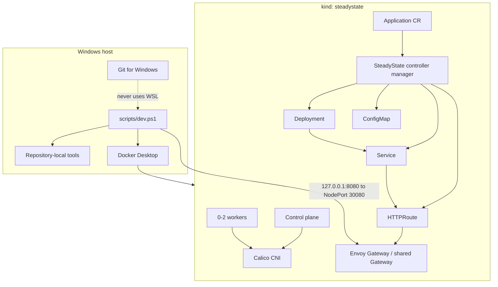

# Architecture Through Phase 1

## Profiles

| Profile | Nodes | Intended use |
|---|---:|---|
| `minimal` | 1 control plane | Pull-request smoke tests and constrained machines |
| `standard` | 1 control plane + 1 worker | Default development profile |
| `full` | 1 control plane + 2 workers | Later end-to-end demonstrations |

Every profile disables kindnet and installs Calico, making NetworkPolicy behavior observable. Envoy Gateway provides the maintained Gateway API implementation for north-south traffic.

Phase 0 owns cluster creation, networking, Gateway API installation, smoke resources, and diagnostics. Phase 1 adds a namespaced `Application` API and a watch-driven controller. GitOps, tenancy, progressive delivery, policy admission, observability, and stateful recovery remain later phases.

## Application ownership contract

The `Application` controller is the sole writer of its generated Deployment, Service, ConfigMap, and HTTPRoute. Every child has a controller owner reference and stable SteadyState labels. Owner watches enqueue reconciliation immediately when a child is deleted or changed; no polling interval is used.

The reconciler preserves Kubernetes-assigned fields such as Service cluster IPs while restoring all SteadyState-owned fields. An unchanged second reconciliation performs zero API writes. The finalizer represents only SteadyState external cleanup; Phase 1 has none, so it releases the finalizer and Kubernetes garbage collection removes the owned children.

## Status contract

`ConfigurationReady`, `SecurityPolicyReady`, `RolloutHealthy`, and `Ready` conditions are maintained with Kubernetes condition helpers. `Ready=True` requires both an available, observed Deployment and an accepted HTTPRoute with resolved references. Status writes use conflict retry and record `observedGeneration`; unsupported future-phase capabilities are reported as degraded without mutating known-good children.
