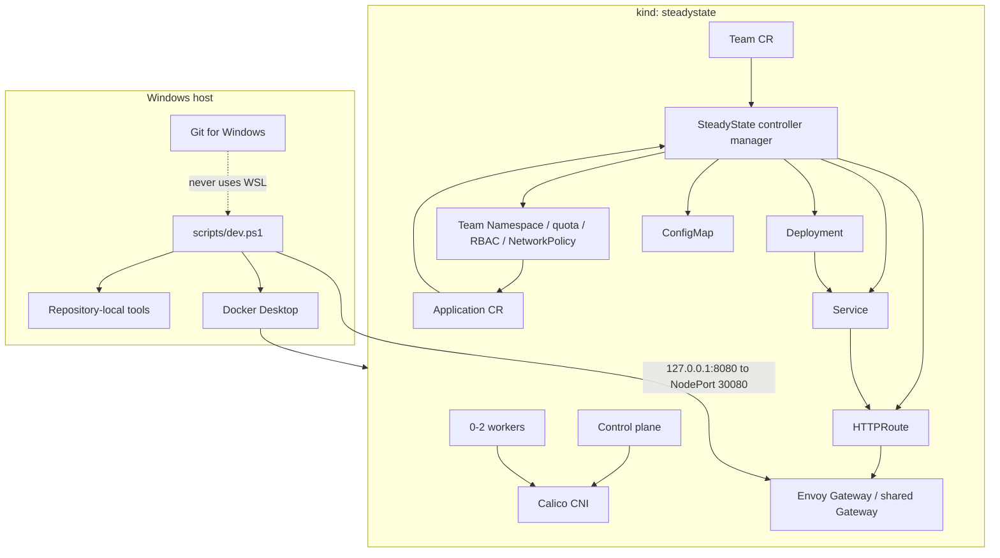

# Architecture Through Phase 2 Tenancy

## Profiles

| Profile | Nodes | Intended use |
|---|---:|---|
| `minimal` | 1 control plane | Pull-request smoke tests and constrained machines |
| `standard` | 1 control plane + 1 worker | Default development profile |
| `full` | 1 control plane + 2 workers | Later end-to-end demonstrations |

Every profile disables kindnet and installs Calico, making NetworkPolicy behavior observable. Envoy Gateway provides the maintained Gateway API implementation for north-south traffic.

Phase 0 owns cluster creation, networking, Gateway API installation, smoke resources, and diagnostics. Phase 1 adds a namespaced `Application` API and a watch-driven controller. Phase 2 adds a cluster-scoped `Team` API and one deterministic `team-<name>` boundary per Team. GitOps, progressive delivery, policy admission, observability, and stateful recovery remain later phases.

## Team tenancy contract

The Team controller owns the desired state of its Namespace, aggregate ResourceQuota, LimitRange defaults, owner RoleBinding, non-automounting ServiceAccount, and default-deny, DNS, and Envoy Gateway NetworkPolicies. A fixed Team owner ClusterRole is installed with the operator and bound only inside each managed Namespace. Because a cluster-scoped Team cannot control namespaced objects through owner references, every generated object carries a Team label and exact Team UID annotation. A reserved object without the matching UID is never adopted. Team deletion verifies both identifiers, deletes the Namespace, waits for namespace cascading, and only then releases the Team finalizer.

Applications are authorized from the Namespace boundary, never from the descriptive `spec.owner` field. The Application controller requires the deterministic namespace name, Team label, exact current Team UID, a non-terminating valid Team, and a repository matching one of the Team's anchored, case-sensitive Go path globs. Team and Namespace watches immediately reevaluate dependent Applications when authorization changes.

## Application ownership contract

The `Application` controller is the sole writer of its generated Deployment, Service, ConfigMap, and HTTPRoute. Every child has a controller owner reference and stable SteadyState labels. Owner watches enqueue reconciliation immediately when a child is deleted or changed; no polling interval is used. A rejected Application does not create or mutate children, so a newly unauthorized change cannot replace the last known-good workload.

The reconciler preserves Kubernetes-assigned fields such as Service cluster IPs while restoring all SteadyState-owned fields. An unchanged second reconciliation performs zero API writes. The finalizer represents only SteadyState external cleanup; Phase 1 has none, so it releases the finalizer and Kubernetes garbage collection removes the owned children.

## Status contract

`ConfigurationReady`, `SecurityPolicyReady`, `RolloutHealthy`, and `Ready` conditions are maintained with Kubernetes condition helpers. `Ready=True` requires both an available, observed Deployment and an accepted HTTPRoute with resolved references. Status writes use conflict retry and record `observedGeneration`; unsupported future-phase capabilities are reported as degraded without mutating known-good children.
