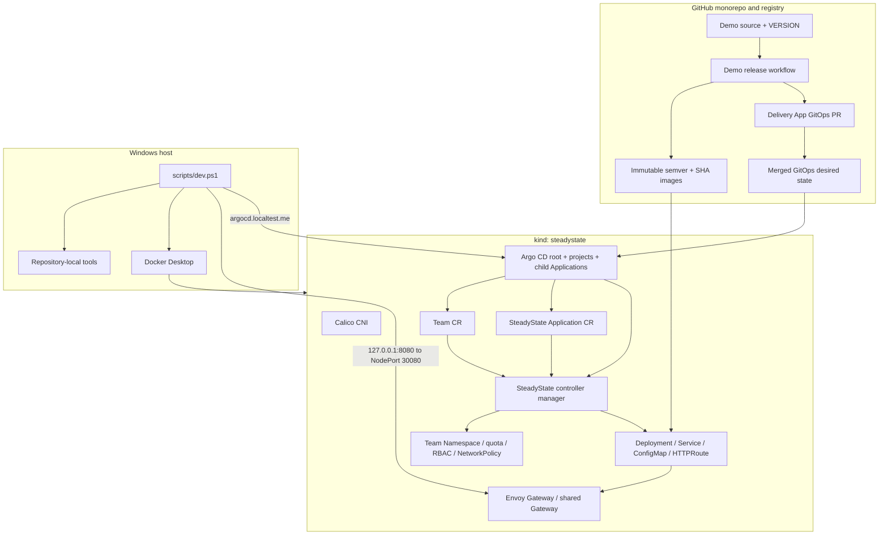

# Architecture Through Phase 3 GitOps

## Profiles

| Profile | Nodes | Intended use |
|---|---:|---|
| `minimal` | 1 control plane | Pull-request smoke tests and constrained machines |
| `standard` | 1 control plane + 1 worker | Default development profile |
| `full` | 1 control plane + 2 workers | Later end-to-end demonstrations |

Every profile disables kindnet and installs Calico, making NetworkPolicy behavior observable. Envoy Gateway provides the maintained Gateway API implementation for north-south traffic.

Phase 0 owns cluster creation, networking, Gateway API installation, smoke resources, and diagnostics. Phase 1 adds a namespaced `Application` API and a watch-driven controller. Phase 2 adds a cluster-scoped `Team` API and one deterministic `team-<name>` boundary per Team. Phase 3 adds pinned Argo CD, immutable demo publication, repository-scoped delivery automation, runtime provenance, and hosted commit-to-cluster acceptance. Progressive delivery, policy admission, observability, and stateful recovery remain later phases.

## Team tenancy contract

The Team controller owns the desired state of its Namespace, aggregate ResourceQuota, LimitRange defaults, owner RoleBinding, non-automounting ServiceAccount, and default-deny, DNS, and Envoy Gateway NetworkPolicies. A fixed Team owner ClusterRole is installed with the operator and bound only inside each managed Namespace. Because a cluster-scoped Team cannot control namespaced objects through owner references, every generated object carries a Team label and exact Team UID annotation. A reserved object without the matching UID is never adopted. Team deletion verifies both identifiers, deletes the Namespace, waits for namespace cascading, and only then releases the Team finalizer.

Applications are authorized from the Namespace boundary, never from the descriptive `spec.owner` field. The Application controller requires the deterministic namespace name, Team label, exact current Team UID, a non-terminating valid Team, and a repository matching one of the Team's anchored, case-sensitive Go path globs. Team and Namespace watches immediately reevaluate dependent Applications when authorization changes.

## Tenancy acceptance contract

`test-isolation` treats Calico readiness as a prerequisite rather than assuming a timeout proves NetworkPolicy enforcement. On a standard-profile cluster it creates payments and orders Teams and runs both Applications concurrently within their independent quotas. An orders Pod must time out against the payments Service ClusterIP, while both applications must remain reachable through their distinct shared-Gateway hostnames. The orders ServiceAccount is authorized for own-namespace Secrets and denied in payments. Forbidden repositories and Applications outside verified Team namespaces must report their exact rejection conditions without creating children, and ResourceQuota admission must reject a Pod above the Team ceiling. Finally, deleting orders must remove its Namespace while payments retains the same Namespace UID and remains Ready and reachable.

The command writes evidence only after every assertion passes. Hosted Nightly validation checks the evidence revision, profile, unique named checks, and result before uploading the JSON, rendered fixtures, and cluster diagnostics.

## GitOps revision and sync contract

The root Argo Application renders the small `gitops/clusters/local` Helm chart. Its resolved `$ARGOCD_APP_REVISION` becomes the `gitRevision` value for every child, preventing a root, platform, and tenant graph from mixing commits. Platform configuration and the operator use automated prune and self-heal. The tenant Application uses automated self-heal without prune; safe Git-driven Team deletion remains a later lifecycle design. `CreateNamespace` is intentionally absent because the Team controller must establish and own `team-payments` before the namespaced Application is admitted.

Sync waves establish AppProjects at `-30`, Argo configuration at `-20`, the operator at `-10`, the tenant child at `0`, the Team CR at `-1`, and the SteadyState Application CR at `0`. Kustomize substitutes the exact Argo source revision into `steadystate.dev/source-revision` on the Team and Application leaves. Argo ignores controller-owned status and finalizers with `RespectIgnoreDifferences=true`.

The root project can create only AppProjects and Argo Applications in `argocd`. The platform project permits the exact cluster- and namespace-scoped kinds needed by Argo configuration and `config/default`. The tenant project permits only cluster-scoped Teams and namespaced SteadyState Applications from this repository into `team-*`; orphan warnings are disabled because generated application children belong to the operator.

## Argo health and ownership contract

Argo uses annotation-based resource tracking. Lua health customizations require current observed generations: a Team is Healthy only with `Ready=True`; a SteadyState Application is Healthy only with `Phase=Healthy` and `Ready=True`, while `Phase=Degraded` maps to Degraded. The Argo Application customization forwards child health so the app-of-apps root waits truthfully.

Argo owns platform configuration, the operator installation, Team CRs, and Application CRs. It never owns the generated Deployment, Service, ConfigMap, or HTTPRoute. Those children retain controller owner references and remain solely reconciled by SteadyState. This prevents competing field managers and lets an operator outage leave the tenant Argo Application Healthy while the data plane and CR UIDs remain stable.

## Application ownership contract

The `Application` controller is the sole writer of its generated Deployment, Service, ConfigMap, and HTTPRoute. Every child has a controller owner reference and stable SteadyState labels. Owner watches enqueue reconciliation immediately when a child is deleted or changed; no polling interval is used. A rejected Application does not create or mutate children, so a newly unauthorized change cannot replace the last known-good workload.

The reconciler preserves Kubernetes-assigned fields such as Service cluster IPs while restoring all SteadyState-owned fields. An unchanged second reconciliation performs zero API writes. The finalizer represents only SteadyState external cleanup; Phase 1 has none, so it releases the finalizer and Kubernetes garbage collection removes the owned children.

## Status contract

`ConfigurationReady`, `SecurityPolicyReady`, `RolloutHealthy`, and `Ready` conditions are maintained with Kubernetes condition helpers. `Ready=True` requires an available observed Deployment, an accepted HTTPRoute with resolved references, and exactly one canonical runtime digest from all ready desired Pods. A GitOps-delivered Application may carry `steadystate.dev/source-revision` with a full lowercase SHA-1 or SHA-256 Git object ID. A successful promotion atomically records `activeVersion`, `resolvedImageDigest`, and `resolvedGitRevision`; an in-progress or failed candidate preserves that last healthy tuple. Invalid revisions are rejected before child mutation, while a revision-only change updates status without rewriting or restarting the workload. Status writes use conflict retry and record `observedGeneration`.
