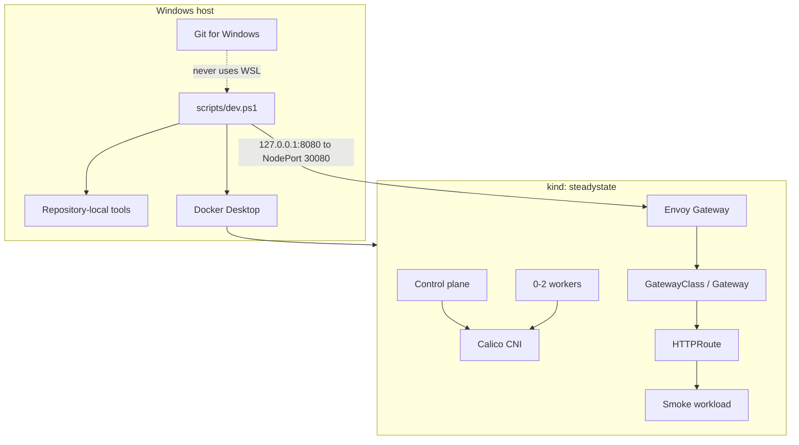

# Phase 0 Architecture

## Profiles

| Profile | Nodes | Intended use |
|---|---:|---|
| `minimal` | 1 control plane | Pull-request smoke tests and constrained machines |
| `standard` | 1 control plane + 1 worker | Default development profile |
| `full` | 1 control plane + 2 workers | Later end-to-end demonstrations |

Every profile disables kindnet and installs Calico, making NetworkPolicy behavior observable. Envoy Gateway provides the maintained Gateway API implementation for north-south traffic.

Phase 0 owns cluster creation, networking, Gateway API installation, smoke resources, and diagnostics. Operator APIs, GitOps reconciliation, progressive delivery, policy admission, observability, and stateful recovery enter in later verified phases.
